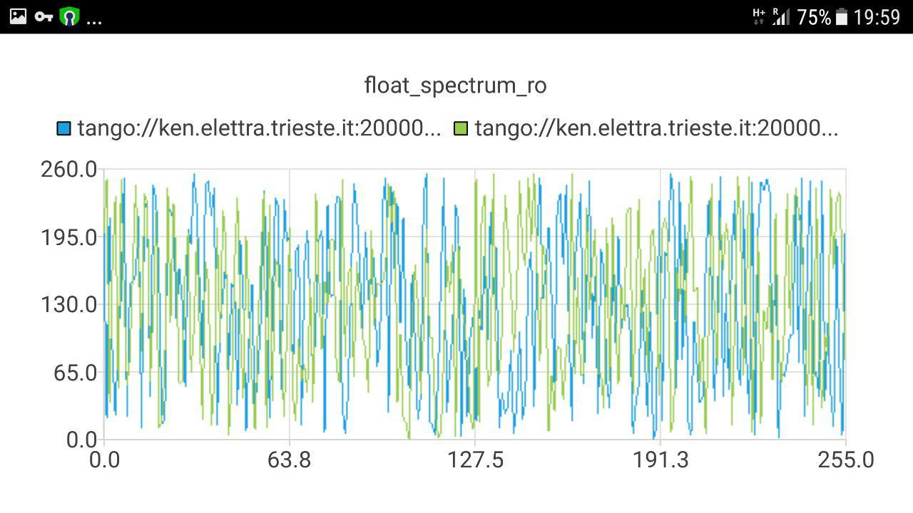
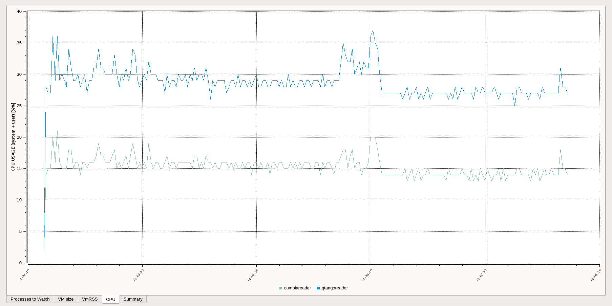

# cumbia library documentation

### Write your own activities
Concentrate on the task you want to run in the background and use *cumbia* base library to write custom *activities* that will be executed on a separate
thread. You will receive the progress updates and the results when they are ready. Nevermind thread synchronization issues.

### Connect with the Tango and Epics (and more...) control system software
Write graphical user interface components and applications communicating with the Tango and Epics control systems. More control system engines can be
added in the future and plugged into existing cumbia installations and applications.

### Keywords and technology
- C++-11
- <a href="https://www.qt.io/">Qt</a>
- <a href="https://doc.qt.io/qt-5.11/qtwidgets-index.html">Qt widgets</a>
- <a href="https://doc.qt.io/qt-5.11/qtqml-index.html">Qt QML</a>
- <a href="http://www.tango-controls.org/">Tango</a>
- <a href="https://epics.anl.gov/">EPICS</a>
- <a href="https://www.android.com/">Android</a>
- <a href="https://en.wikipedia.org/wiki/Linux">Linux</a>

### Everywhere
cumbia is written in C++ and uses the Qt libraries to develop graphical user interfaces. This means *cumbia applications* work on *desktop computers* as well as
on *Android* devices. In principle, cumbia is available *wherever C++ and Qt are supported*. *Android* and *Linux* platforms have been successfully tested and
porting an application from one platform to another is just a matter of a few clicks with the *Qt creator* IDE.

### Plugins
*cumbia* libraries provide a set of fundamental capabilities that can be summarized in the concepts above. A set of plugins extends those functions
and new ones can be added. The core framework remains small and easy to maintain, while the power grows distributed.

### Screenshots
<a href="screenshots.md">Here</a> you can see some screenshots of applications written with *cumbia*.

### Installation

To download and install *cumbia*, refer to the instructions in the <a href="https://github.com/ELETTRA-SincrotroneTrieste/cumbia-libs">cumbia-libs</a> *README.md*
file.

Instructions to prepare an *ubuntu-desktop* for *cumbia*, can be found in the *README.UBUNTU.md* file under 
<a href="https://github.com/ELETTRA-SincrotroneTrieste/cumbia-libs">cumbia-libs</a>.

The library sources include copies of the *README.md* and *README.UBUNTU.md* files in the top level directory.

### Tutorials

 |Tutorials                                     | Module               |
 |-------------------------------------------------------------------|--------------------------|
 |  <a href="html/cumbia/html/tutorial_cuactivity.html">Writing a *cumbia* activity</a> | <a href="html/cumbia/html/index.html">cumbia</a> |
 |  <a href="html/cumbia-tango/html/tutorial_activity.html">Writing an activity</a> | <a href="html/cumbia-tango/html/index.html">cumbia-tango</a> |
 |  <a href="html/cumbia-tango/html/cudata_for_tango.html">CuData for Tango</a> | <a href="html/cumbia-tango/html/index.html">cumbia-tango</a> |
 |  <a href="html/qumbia-tango-controls/html/tutorial_cumbiatango_widget.html">Writing a Qt widget that integrates with cumbia</a> | <a href="html/qumbia-tango-controls/html/index.html">qumbia-tango-controls</a>  |
 |  <a href="html/cuuimake/html/cuuimake.html">Using <em>cumbia ui make</em></a> to process Qt designer UI files | <a href="html/cuuimake/html/index.html">qumbia-apps/cuuimake</a>  |
 |  <a href="html/qumbiaprojectwizard/html/tutorial_qumbiatango.html">Writing a <em>Qt application</em> with cumbia and Tango</a>. |<a href="html/qumbiaprojectwizard/html/index.html">qumbia-apps/qumbiaprojectwizard</a>  |
 |  <a href="html/qumbiaprojectwizard/html/tutorial_from_qtango.html">Porting a <em>QTango application</em> to <em>cumbia-tango</em></a>. |<a href="html/qumbiaprojectwizard/html/index.html">qumbia-apps/qumbiaprojectwizard</a>  |
 |  <a href="html/qumbianewcontrolwizard/html/tutorial_qumbianewcontrolwizard.html"><em>cumbia new control</em></a>: quickly add a custom Qt widget to a cumbia project | <a href="html/qumbianewcontrolwizard/html/index.html">qumbia-apps/qumbianewcontrolwizard</a>  |
 |  <a href="html/cumbia-qtcontrols/html/understanding_cumbia_qtcontrols_constructors.html">Understanding <em>cumbia-qtcontrols constructors, sources and targets</em></a> |<a href="html/cumbia-qtcontrols/html/index.html">cumbia-qtcontrols</a>. |

### Modules

 |*cumbia* modules  |
 |-------------------------------------------------------------------|
 | <a href="html/cumbia/html/index.html">cumbia base</a>. |
 | <a href="html/cumbia-tango/html/index.html">cumbia-tango</a>. |
 | <a href="html/cumbia-qtcontrols/html/index.html">cumbia-qtcontrols</a>.  |
 | <a href="html/qumbia-tango-controls/html/index.html">cumbia-qtcontrols</a>.  |
 | <a href="html/cumbia-epics/html/index.html">qumbia-epics</a>.   |
 | <a href="html/qumbia-epics-controls/html/index.html">qumbia-epics-controls</a>.  |
 | <a href="html/cumbia-websocket/html/index.html"cumbia-websocket">cumbia-websocket</a>.  |

### Apps

*cumbia* provides some applications as part of the software distribution.
If you followed the *scripts/cubuild.sh* install method, they should be ready to use.

Otherwise, they have to be installed from the *qumbia-apps* sub-directory of the *cumbia-libs* distribution.
To do this, *cd* into that folder and execute:
 

> qmake

> make

> sudo make install

 
Along with the application executables and documentation, two bash scripts will be installed:
 
- /usr/local/bin/cumbia  (or whatever/install/prefix/bin/cumbia)
- /usr/share/bash-completion/completions/cumbia  (or wherever points the output of `pkg-config --variable=completionsdir bash-completion` )

They define shortcuts for the common operations provided by the *cumbia applications* as follows:
 
 
|Applications (command line)   | description                                 | app
|------------------------------|--------------------------------------------|:---------------:|
| *cumbia new project*          | create a new cumbia project               |<a href="html/qumbiaprojectwizard/html/index.html">qumbia-apps/qumbiaprojectwizard</a>  |
| *cumbia import*               | migrate a QTango project into cumbia      |<a href="html/qumbiaprojectwizard/html/index.html">qumbia-apps/qumbiaprojectwizard</a>  |
| *cumbia new control*          | write a *cumbia control* reader or writer | <a href="html/qumbianewcontrolwizard/html/index.html">qumbia-apps/qumbianewcontrolwizard</a>  |
| *cumbia ui make*              | run *cuuimake* to generate *qt+cumbia* ui_*.h files | <a href="html/cuuimake/html/index.html">qumbia-apps/cuuimake</a>  |
| *cumbia client*               | run a generic cumbia client | <a href="html/cumbia_client/html/index.html">qumbia-apps/cumbia_client</a>  |
| *cumbia upgrade*              | upgrade to a newer version of cumbia|  - |

*bash auto completion* will help you find out these shortcuts: try

> cumbia [+TAB]
 
or

> cumbia new [+TAB]

After the installation, it may be necessary to type

> source /etc/profile

from the current shell or log out and log in again.

#### Want to *TangoTest* ?

If the *TangoTest* device is running, you can immediately try the generic *cumbia client*:

> cumbia client test/device/1/double_scalar test/device/1/long_scalar

### Performance

*cumbia* can be seen both as an extension and an evolution of the well known and long standing  *qtango* framework. Additionally, it offers a relevant 
improvement in performance.

The screenshot above shows a relevant gap in *CPU* usage by two equivalent applications (they read the same *attributes/commands* from the *Tango*
control system and print them on the console), one relying on *qtango* (blue), the other on *cumbia* (green).

### Are you ready?
 
Start reading the <a href="html/cumbia/html/index.html">cumbia base library documentation</a> or <a href="https://elettra-sincrotronetrieste.github.io/cumbia-libs/html/qumbiaprojectwizard/html/index.html">writing a new cumbia application</a>.

